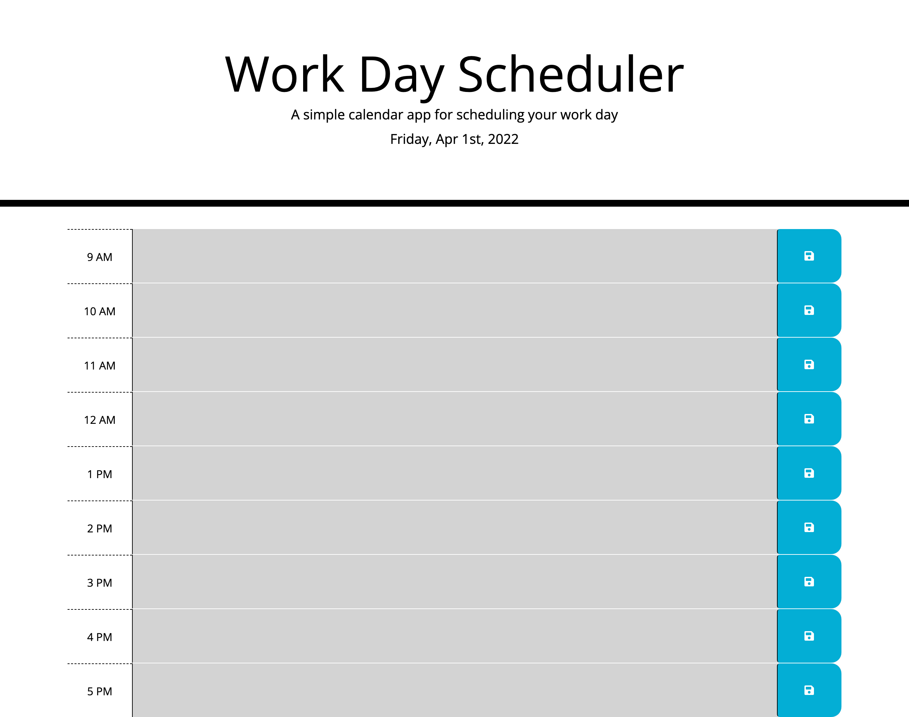
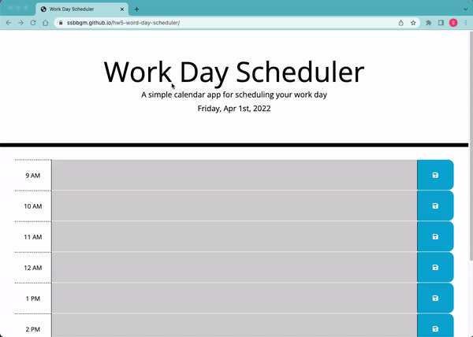

# hw5-word-day-scheduler

# DESCRIPTION

This is a simple calendar application that allows a user to save event for each hour of the day by modifying starter code. This app runs in the browser and features dynamically updated HTML and CSS powered by Bootstrap and jQuery.

## VISUALS






## POINTS OF INTEREST

```
GIVEN I am using a daily planner to create a schedule 
WHEN I open the planner 
THEN the current day is displayed at the top of the calendar 
WHEN I scroll down 
THEN I am presented with timeblocks for standard business hours 
WHEN I view the timeblocks for that day 
THEN each timeblock is color coded to indicate whether it is in the past, present, or future 
WHEN I click into a timeblock 
THEN I can enter an event 
WHEN I click the save button for that timeblock 
THEN the text for that event is saved in local storage 
WHEN I refresh the page 
THEN the saved events persist 
```


## DEPLOYED APPLICATION

https://ssbbgm.github.io/hw5-word-day-scheduler/

